<h1 align="center">Hello World! I'm Eber 👋</h1>

<b>Lead &amp; Software Engineer</b> · backend &amp; data platforms · multi-tenant SaaS · AI agents

  Brazilian engineer building the systems behind multi-tenant, franchise-scale
  operations — data pipelines, messaging automation and AI agents — mostly in
  <b>Go</b>, <b>Python</b> and <b>TypeScript</b> on PostgreSQL.
  I graduated from "Hello World" to "why is prod doing that at 2&nbsp;a.m." — and I'm here for it.

<ul>
  <li>🛠️ Shipping data/BI platforms, WhatsApp campaign systems &amp; AI agents at scale.</li>
  <li>🧊 Most of my work lives in private, proprietary systems — the public trail is the tip of the iceberg.</li>
  <li>🎓 Computer Engineering @ UAB (Portugal) · once a programming student in Canada (Niagara College).</li>
  <li>🍳 Off the clock: cooking, a full table of friends, movies, games — and my wife tolerating all of it.</li>
</ul>

## 🧱 What I build

| Domain | What it means | Stack |
|---|---|---|
| **Data platforms** | ETL/ELK ingestion, Postgres modeling, observability | Python · PostgreSQL · ELK · Docker |
| **Multi-tenant SaaS** | tenant isolation, RLS, auth, quotas | Go · Postgres/RLS · SuperTokens · React |
| **Messaging & automation** | WhatsApp at scale, inbound bots, scraping | Chatwoot · Playwright |
| **AI agents** | reason engines, message composition, tracing | OpenAI · Langfuse |

## 🔥 Stack

  
  
  
  
  
  
  
  
  
  
  
  
  
  
  
  
  
  
  
  
  
  
  

## 📈 Activity

  

  

  

  

  
  

